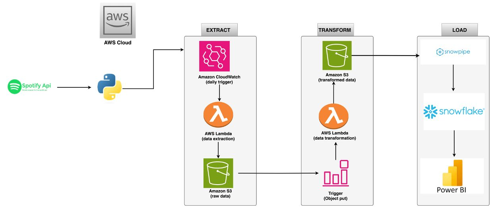

# 🎧 Spotify Data Pipeline: Extract, Transform, Load with AWS & Snowflake 📊

🚗 **Project Overview**

The **Spotify Data Pipeline** project automates the extraction, transformation, and loading of Spotify data using **AWS services** and **Snowflake**. The pipeline ensures scalability, reliability, and efficiency in handling large datasets from the **Spotify API**. With the integration of **Power BI**, the pipeline offers valuable insights through real-time analytics and interactive visualizations.

### Key Features:
- 🎶 **Real-time Data Extraction**: Automatically fetch data from the **Spotify API** (track details, artist stats, playlists, etc.).
- 🔄 **Data Transformation**: Cleanse and prepare raw Spotify data to be analysis-ready.
- 📊 **Seamless Data Analysis**: Perform advanced analytics using **AWS Glue**, **Athena**, and **Snowflake**.
- ⚙️ **Fully Automated Workflow**: Data extraction, transformation, and loading happen automatically with minimal manual intervention.
- 📱 **Scalable & Reliable**: Leverage **AWS Lambda** for automation and scalability without worrying about server management.

This project brings your **Spotify data** to life with an automated, cloud-native solution for deeper insights and business intelligence.

🛠️ **Architecture & Services Used**

The pipeline integrates with various **AWS services** and **Snowflake** to process data extracted from the **Spotify API**. Here's how it works:

### Services Involved:
- **Spotify API**: Fetch real-time data from Spotify (track info, artist data, playlists).
- **AWS Lambda**: Automatically extract data from Spotify at scheduled intervals or event triggers.
- **AWS S3**: Store raw and transformed data in an organized, accessible way.
- **AWS Glue**: Perform ETL tasks (data cleaning, schema definition) for analysis-ready data.
- **Amazon Athena**: Query the data stored in **S3** using SQL-like syntax for advanced insights.
- **Snowflake**: Data warehouse solution for storing and analyzing large datasets.
- **Power BI**: Business analytics tool for creating interactive visualizations and dashboards.

### Pipeline Flow:
1. **Extract**: Fetch data from Spotify API and store it in **S3**.
2. **Transform**: Clean, format, and structure the data for easy analysis.
3. **Store**: Save the transformed data into **S3**, keeping it organized by genre, artist, or other relevant categories.
4. **Analyze**: Perform in-depth analysis using **Athena** and **Snowflake** for business insights.
5. **Visualize**: Use **Power BI** to generate insightful dashboards for data-driven decision-making.

💻 **How It Works**

### 1. Real-Time Data Extraction
- **Lambda Functions** automatically fetch data from the **Spotify API** (track info, artist data, playlists).
- **AWS CloudWatch** schedules triggers for the **Lambda Functions**, ensuring fresh data is pulled at regular intervals.
- Data is stored in **S3** for further processing.

### 2. Data Transformation
- Raw data is processed by **AWS Lambda**, ensuring it's cleaned, normalized, and formatted.
- The transformed data is stored in **S3**, organized by categories like **track**, **artist**, **playlist**, and more.

### 3. Storing Data in S3
- Transformed data is uploaded to **AWS S3** for long-term storage.
- **AWS Glue** is used to define schemas and catalog the data for easy access and querying.

### 4. Data Analysis with Athena & Snowflake
- **Amazon Athena** is used for querying the data stored in **S3**, enabling fast, serverless analysis.
- **Snowflake** is used for scalable data warehousing, ensuring that large datasets are efficiently stored and queried.
  
### 5. Interactive Dashboards with Power BI
- **Power BI** connects to **Snowflake** for real-time visualizations, enabling insights into Spotify usage trends, artist popularity, and more.

🔧 **System Workflow**

### 1. Data Collection:
- **AWS Lambda** functions trigger at regular intervals to call the **Spotify API** and retrieve data like artist stats, track details, and playlist information.
- This data is stored in **S3** for subsequent processing.

### 2. Data Transformation:
- The data is processed using **AWS Glue** for transformation (e.g., normalization, formatting).
- This data is stored in a structured manner on **S3** by category (e.g., by artist, genre, or playlist).

### 3. Data Storage:
- **S3** serves as the main storage layer for raw and transformed data.
- The transformed data is stored in structured folders, making it easy to query and analyze.

### 4. Data Analysis:
- Use **Athena** to query the transformed data from **S3** using SQL-like syntax.
- **Snowflake** enables fast, scalable querying of large datasets.

### 5. Data Visualization:
- **Power BI** integrates with **Snowflake** to create interactive dashboards, offering insights into popular tracks, artist performance, and playlist trends.

🔄 **How to Set Up the Spotify Data Pipeline**

### Step 1: Set up Spotify API Access
- Create a **Spotify Developer** account [here](https://developer.spotify.com).
- Obtain your **API keys** and configure **OAuth tokens** for authentication.

### Step 2: Set Up AWS S3
- Create S3 buckets to store raw and transformed data (e.g., `spotify-data/raw` and `spotify-data/transformed`).
- Organize your buckets by genres, artists, or playlists for easy data management.

### Step 3: Create AWS Lambda Functions
- Use **AWS Lambda** to automate the data extraction process.
- Set triggers to fetch data from the **Spotify API** at regular intervals (e.g., every hour or daily).

### Step 4: Implement Data Transformation with AWS Glue
- Configure **AWS Glue** for ETL jobs to clean and transform the raw Spotify data.
- Define schemas for the transformed data to ensure it is properly structured for analysis.

### Step 5: Query with Amazon Athena
- Set up **Amazon Athena** to run queries on the transformed data stored in **S3**.
- Leverage **AWS Glue** for schema creation and data cataloging to facilitate easier querying.

🎯 **Demonstration**

The diagram below illustrates the flow of the Spotify Data Pipeline:

1. **Data Extraction**: Spotify data is pulled and stored in **S3**.
2. **Data Transformation**: Raw data is cleaned and formatted.
3. **Data Analysis**: Insights are extracted using **Athena** and **Snowflake**.
4. **Visualization**: Data is visualized in **Power BI** for business insights.

🚀 **Future Enhancements**

While this pipeline already provides core functionality, there are many exciting possibilities for future improvements:

- 🔗 **Integration with AI Models**: Predict user preferences and recommend music based on trends.
- 🛰️ **Real-Time Analytics Dashboard**: Implement a dashboard using **AWS QuickSight** for live visualizations.
- 📱 **Mobile Integration**: Allow users to interact with the data pipeline through a mobile app.
- ⚡ **Enhanced Scalability**: Improve scalability to handle larger datasets with AWS auto-scaling.
  
## License

This project is licensed under the MIT License - see the [LICENSE](LICENSE) file for details.

Feel free to copy, paste, and modify this for your **README.md**!
